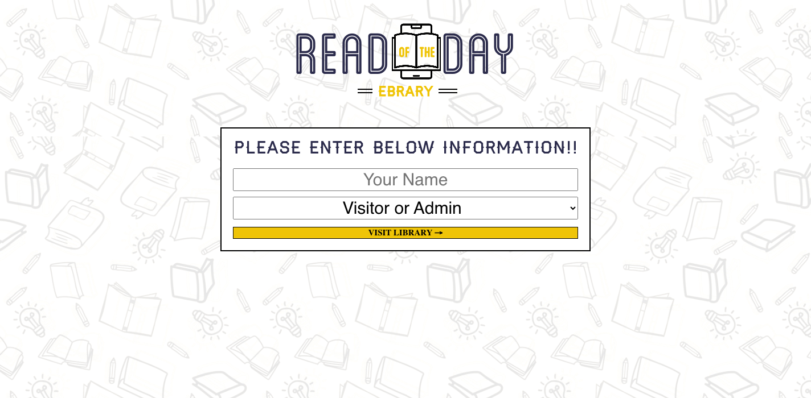
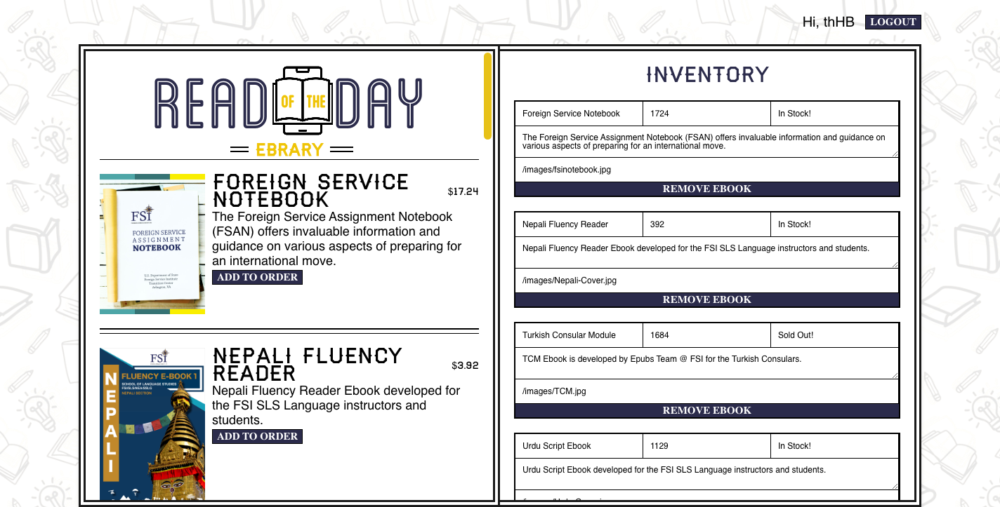
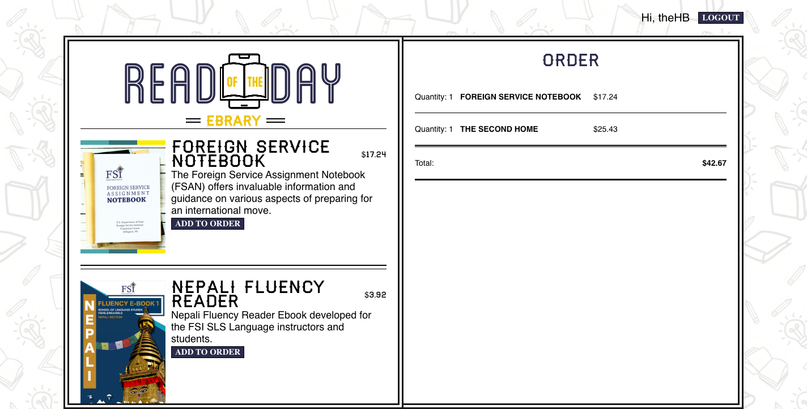
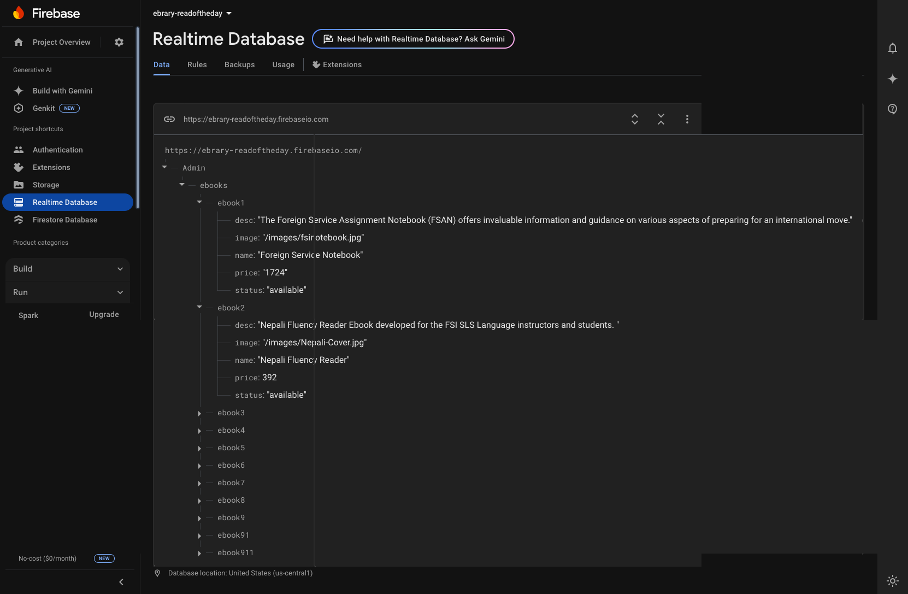

## ebrary - read of the day

<h2>🗣️ About this project</h2>

  A react store that sells ebook. Ebrary is a dynamic web application that allows users to view a dynamic library, add items to their order, and see their order summary in real-time. Ebrary manages real-time updates through Firebase database.

<ul>
<li>NodeJS</li>
<li>Firebase
<ul>
<li>Realtime Database</li>
<li>Authentication</li>
</ul>
</li>
</ul>

<h2>👨‍💻 Demo</h2>

Check out the live app: <a href="https://ebrary-readoftheday.netlify.app/">ebrary-readoftheday</a>

Realtime Database: <a href="https://console.firebase.google.com/project/ebrary-readoftheday/">Firebase Console</a> 
<table>
<tr>
<td></td>
<td></td>
</tr>
<tr>
<td></td>
<td></td>
</tr>
</table>
